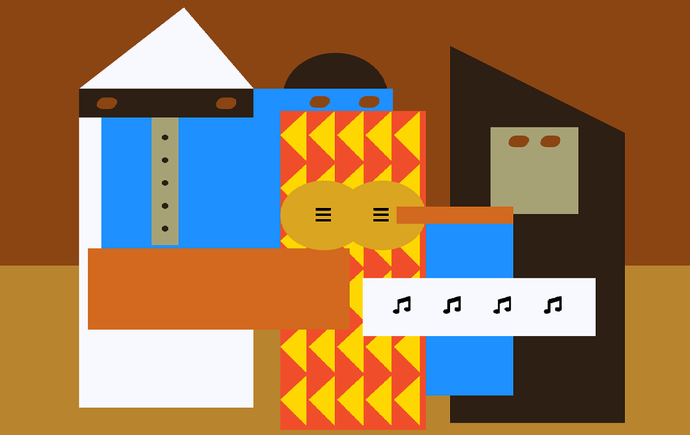

# fcc-picasso-painting

Picasso Painting made on FreeCodeCamp to learn more about CSS (intermediate level)

## Preview

In this course I better understood these concepts:

- `z-index` it’s used to create “layers” in HTML, similar to image editors.

## Conclusion

Besides `z-index`, I've already used at least one time these properties presented on this course. But it is interesting to watch how the elements develop after every property and value are added.

My current goal is to master React, but first I need to complete some begginer courses on FreeCodeCamp.